# Diagrams

Diagrams can be rendered using <Url urlKey="mermaid" /> in a code block.

## Use

The CMS directly supports editing Mermaid diagrams.

1. Click the **Mermaid** icon.
2. Enter the Markdown in the box.

Click **Preview** to view your diagram.

<Admonition type="note" title="Note">
  Currently, zenUML diagrams are not supported and mind map diagrams may produce unusual behaviour. Not all diagram types can be previewed in the CMS.
</Admonition>

For more information, refer to [Mermaid](https://tina.io/docs/reference/rich-text-usage/mermaid) in the TinaCMS documentation.

For information on theming Mermaid, refer to <Url urlKey="docusaurus-diagrams" /> in the Docusaurus documentation.

## Examples

### Architecture diagram

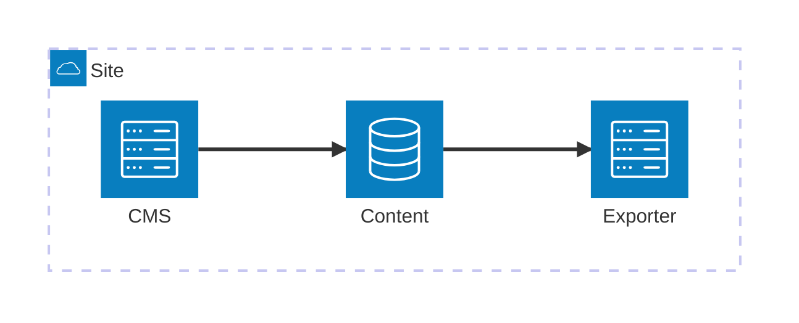

### Block diagram

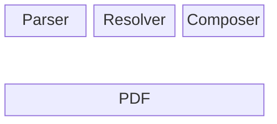

### C4 context diagram

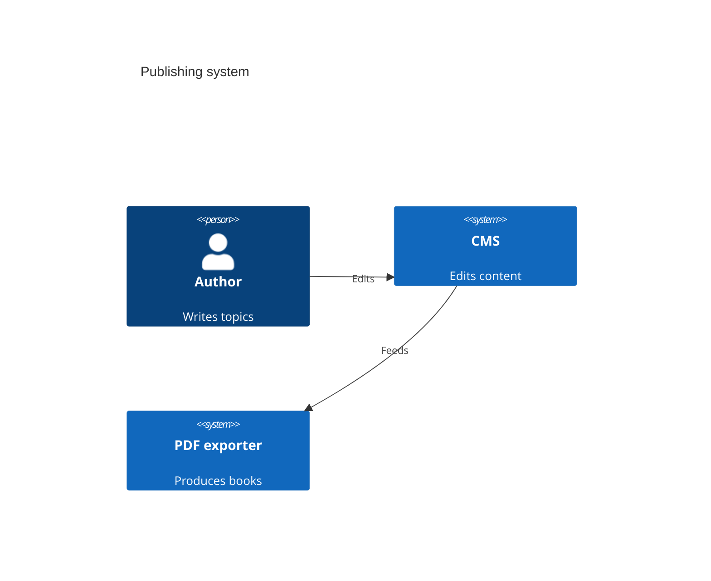

### Class diagram

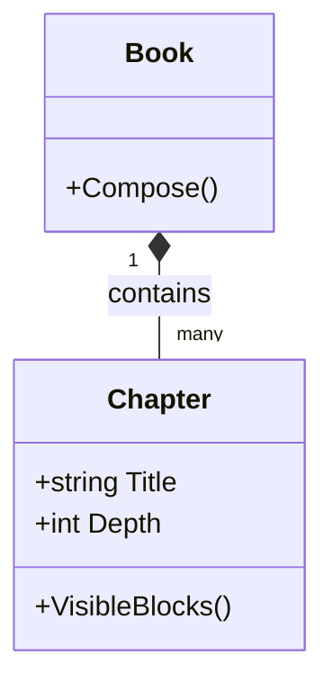

### Entity relationship diagram

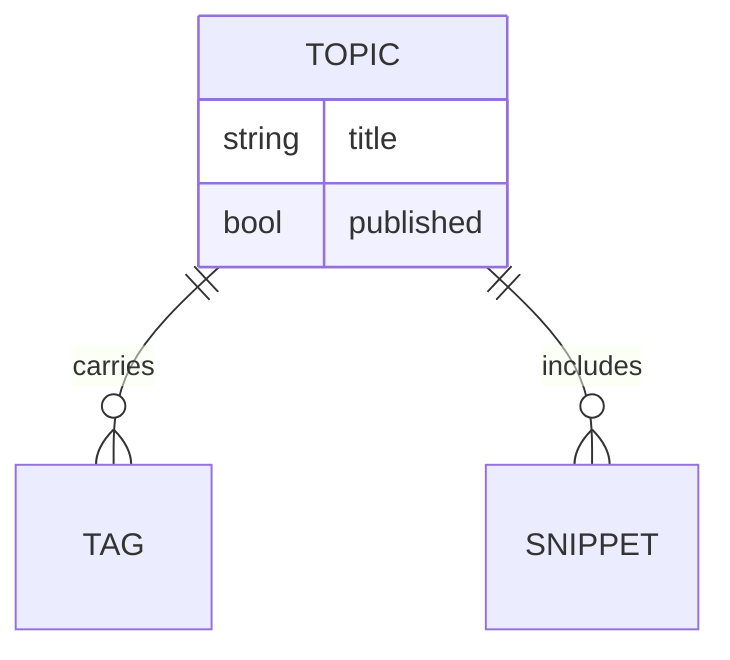

### Flowchart

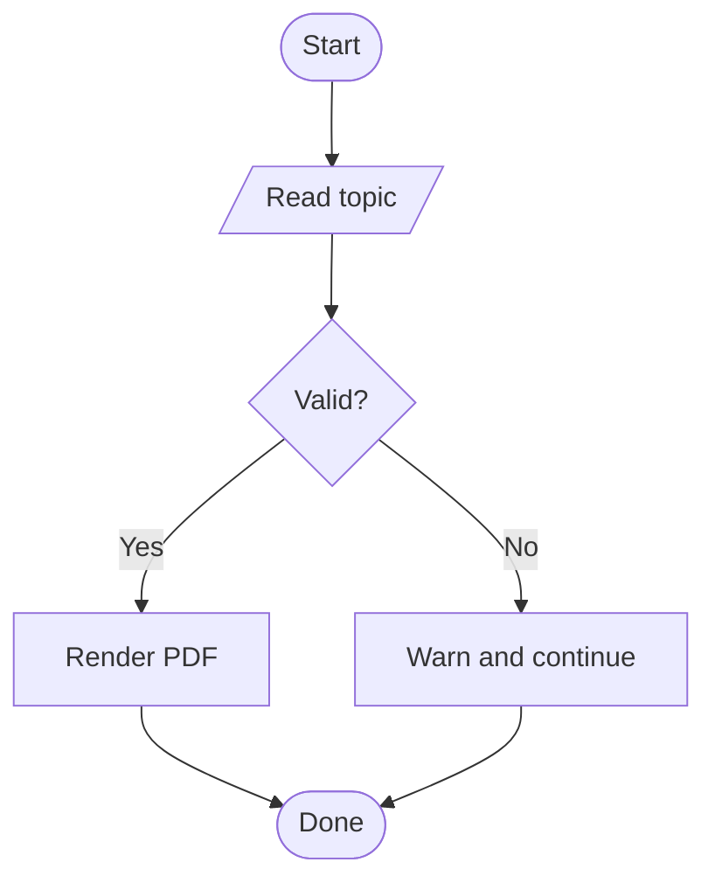

### Gantt chart

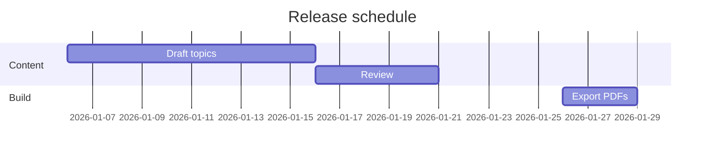

### Git graph

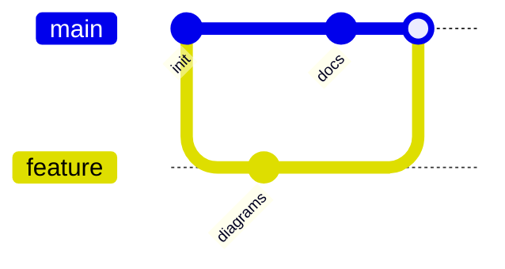

### Kanban board

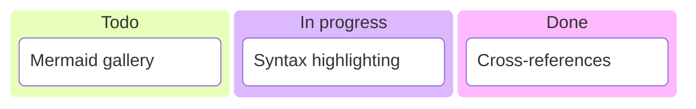

### Mindmap

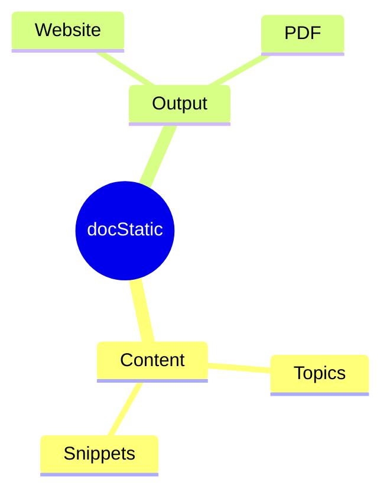

### Packet diagram

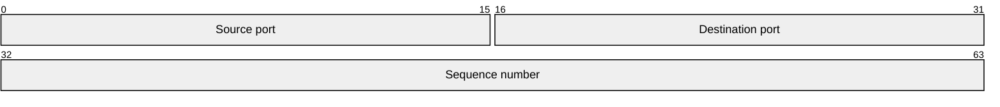

### Pie chart

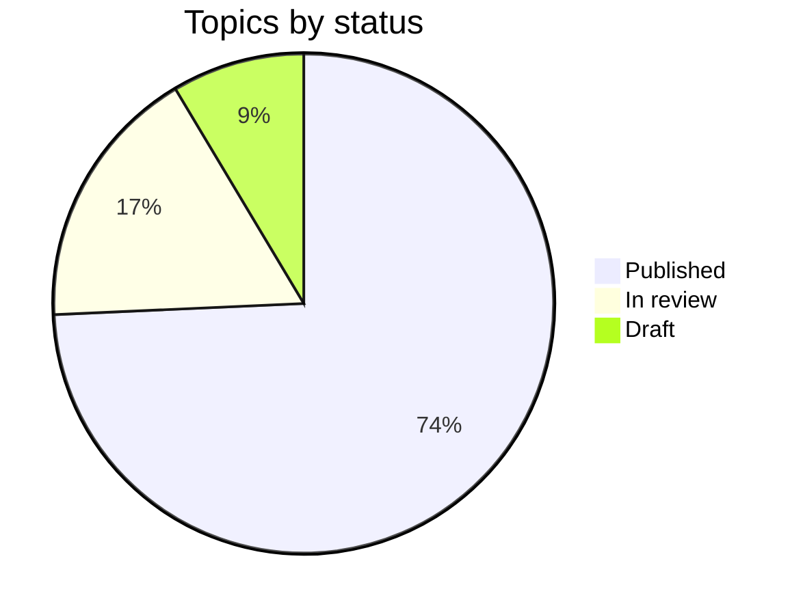

### Quadrant chart

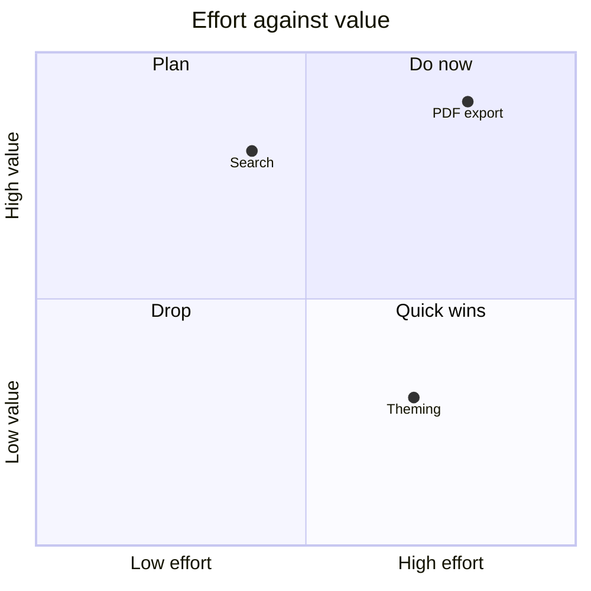

### Radar chart

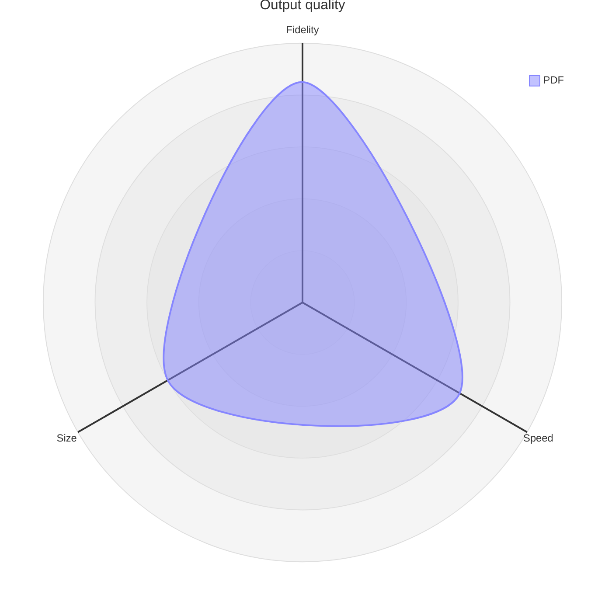

### Requirement diagram

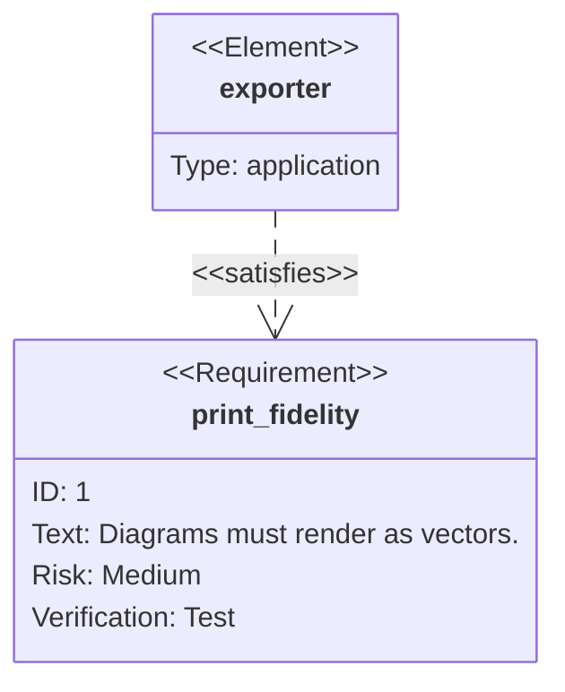

### Sankey diagram

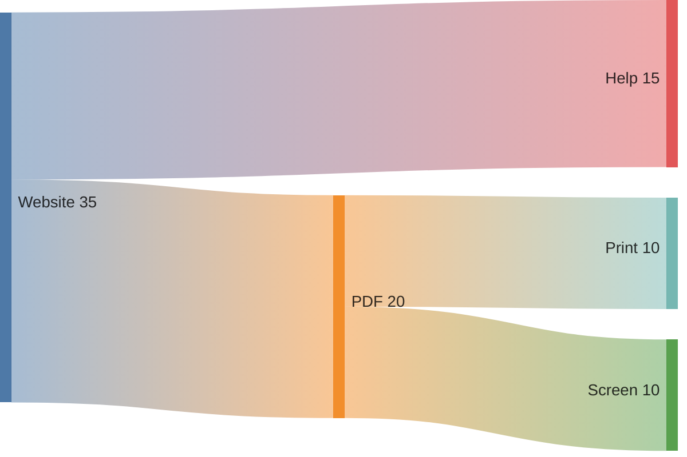

### Sequence diagram

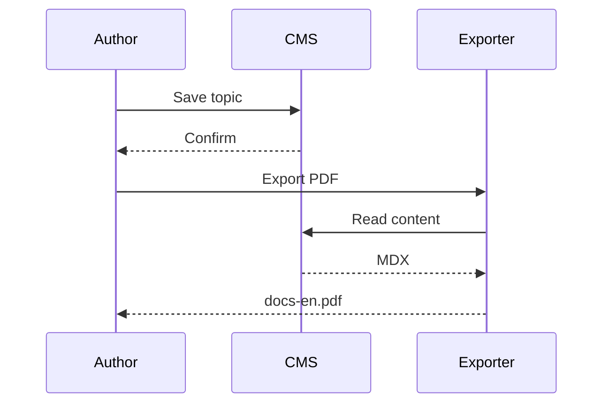

### State diagram

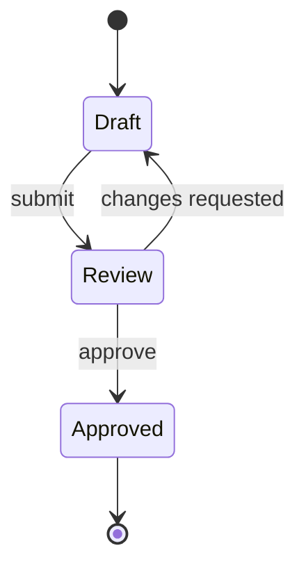

### Timeline

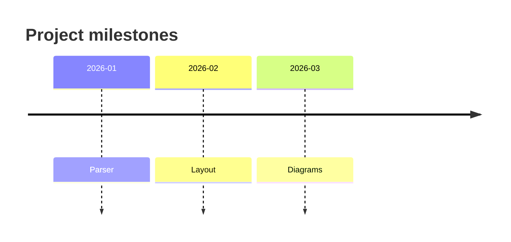

### Treemap

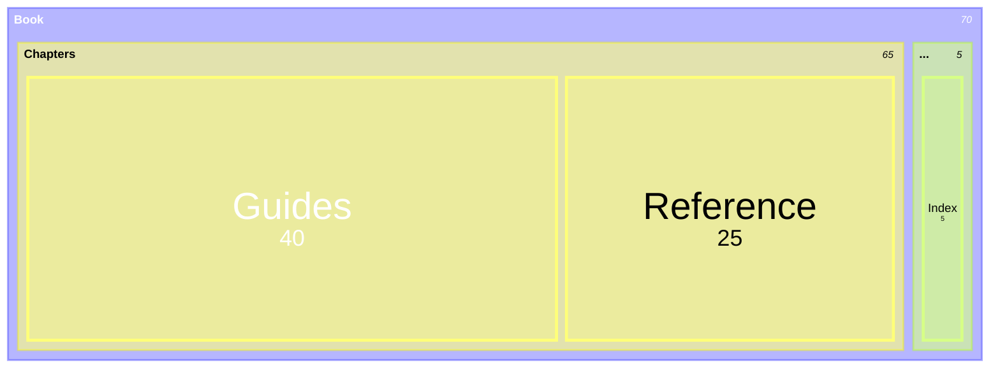

### User journey

```mermaid
journey
    title Publishing a topic
    section Write
      Draft the topic: 4: Author
      Add screenshots: 3: Author
    section Publish
      Review: 3: Editor
      Export PDF: 5: Author
```

### XY chart

```mermaid
xychart-beta
    title "Pages per release"
    x-axis [v1, v2, v3, v4]
    y-axis "Pages" 0 --> 120
    bar [40, 65, 88, 101]
    line [40, 65, 88, 101]
```

<RelatedTopics maxResults={7} />
