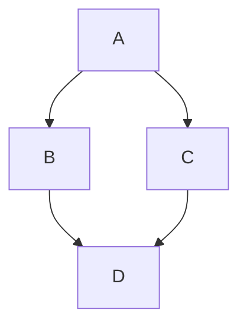

# Diagramme

Diagramme können mithilfe von <Url urlKey="mermaid" /> in einem Code-Block dargestellt werden.

## Verwendung

Das CMS unterstützt die Bearbeitung von Mermaid-Diagrammen direkt.

1. Klicken Sie auf das **Mermaid**-Symbol.
2. Geben Sie den Markdown-Code in das Feld ein.

Klicken Sie auf **Vorschau**, um Ihr Diagramm anzuzeigen.

#### Beispiel:

<Admonition type="note" title="Note">
  Currently, zenUML diagrams are not supported and mind map diagrams may produce unusual behaviour. Not all diagram types can be previewed in the CMS.
</Admonition>

Weitere Informationen finden Sie unter [Mermaid](https://tina.io/docs/reference/rich-text-usage/mermaid) in der TinaCMS-Dokumentation.

Informationen zur Gestaltung von Mermaid-Diagrammen finden Sie unter <Url urlKey="docusaurus-diagrams" /> in der Docusaurus-Dokumentation.

<RelatedTopics maxResults={7} />
