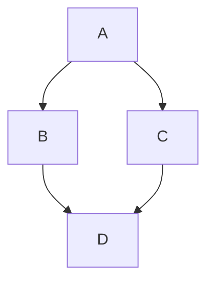

# Diagramas

Los diagramas se pueden generar utilizando [Mermaid](https://mermaid.js.org/) en un bloque de código.

## Uso

El CMS permite editar directamente diagramas de Mermaid.

1. Haz clic en el icono **Mermaid**.
2. Introduce el código Markdown en el cuadro.

Haz clic en **Vista previa** para ver tu diagrama.

#### Ejemplo:

<Admonition type="note" title="Note">
  Currently, zenUML diagrams are not supported and mind map diagrams may produce unusual behaviour. Not all diagram types can be previewed in the CMS.
</Admonition>

Para obtener más información, consulta [Mermaid](https://tina.io/docs/reference/rich-text-usage/mermaid) en la documentación de TinaCMS.

Para obtener información sobre cómo personalizar el aspecto de Mermaid, consulta [Diagramas](https://docusaurus.io/docs/markdown-features/diagrams) en la documentación de Docusaurus.

<RelatedTopics maxResults={7} />
