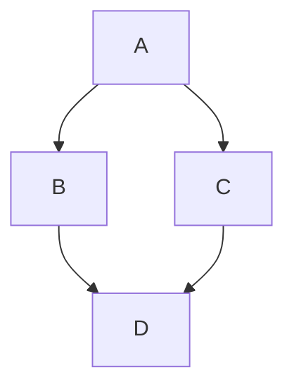

# Diagrammes

Les diagrammes peuvent être générés à l'aide de [Mermaid](https://mermaid.js.org/) dans un bloc de code.

## Utilisation

Le CMS prend directement en charge l'édition des diagrammes Mermaid.

1. Cliquez sur l'icône **Mermaid**.
2. Saisissez le code Markdown dans la zone prévue à cet effet.

Cliquez sur **Aperçu** pour visualiser votre diagramme.

#### Exemple :

<Admonition type="note" title="Note">
  Currently, zenUML diagrams are not supported and mind map diagrams may produce unusual behaviour. Not all diagram types can be previewed in the CMS.
</Admonition>

Pour plus d’informations, consultez la section [Mermaid](https://tina.io/docs/reference/rich-text-usage/mermaid) dans la documentation de TinaCMS.

Pour plus d’informations sur la personnalisation des thèmes Mermaid, consultez la section <Url urlKey="docusaurus-diagrams" /> dans la documentation Docusaurus.

<RelatedTopics maxResults={7} />
