# Schémas

Les diagrammes peuvent être générés à l'aide de <Url urlKey="mermaid" /> dans un bloc de code.

## Utilisation

Le CMS prend directement en charge l'édition des diagrammes Mermaid.

1. Cliquez sur l'icône **Mermaid**.
2. Saisissez le code Markdown dans le champ prévu à cet effet.

Cliquez sur **Aperçu** pour visualiser votre diagramme.

<Admonition type="note" title="Remarque">
  À l'heure actuelle, les diagrammes zenUML ne sont pas pris en charge et les diagrammes de type « mind map » peuvent présenter un comportement inhabituel. Il n'est pas possible de prévisualiser tous les types de diagrammes dans le CMS.
</Admonition>

Pour plus d’informations, consultez la section [Mermaid](https://tina.io/docs/reference/rich-text-usage/mermaid) dans la documentation de TinaCMS.

Pour plus d’informations sur la personnalisation de Mermaid, consultez la section <Url urlKey="docusaurus-diagrams" /> de la documentation Docusaurus.

## Exemples

### Diagramme d’architecture

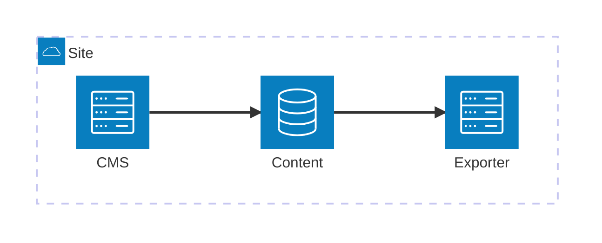

### Diagramme fonctionnel

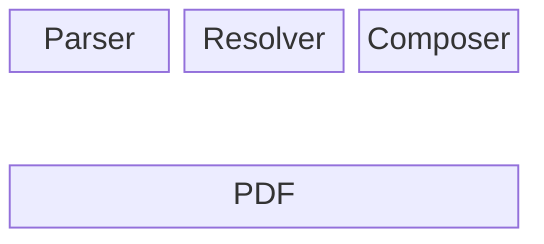

### Diagramme de contexte C4

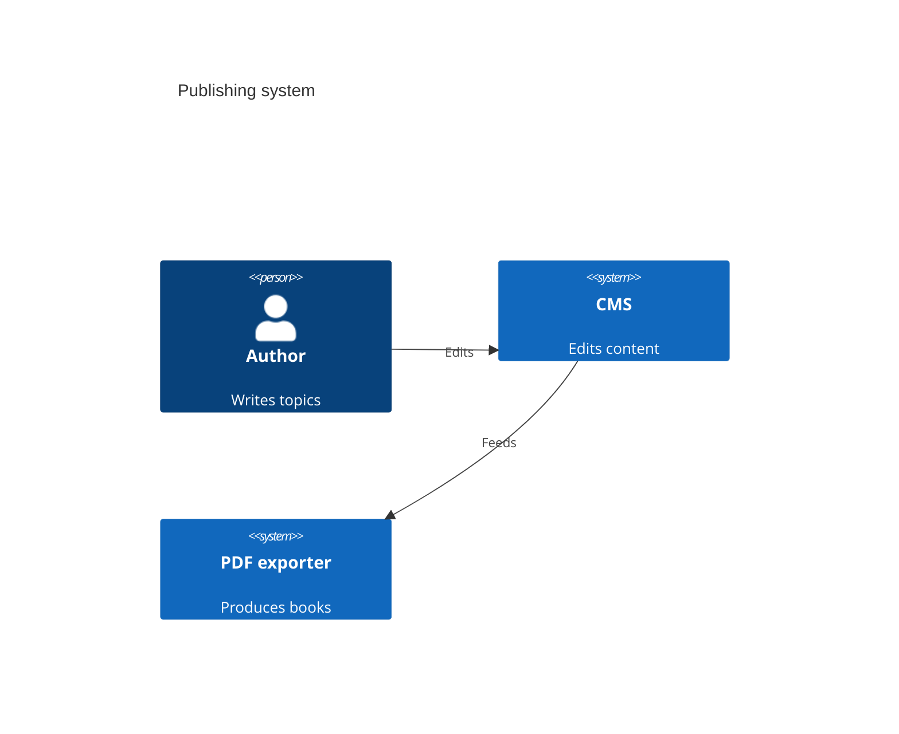

### Diagramme de classes

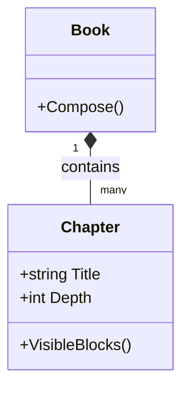

### Diagramme entité-relation

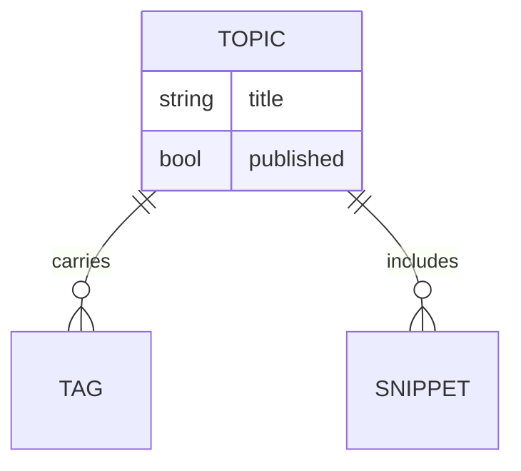

### Organigramme

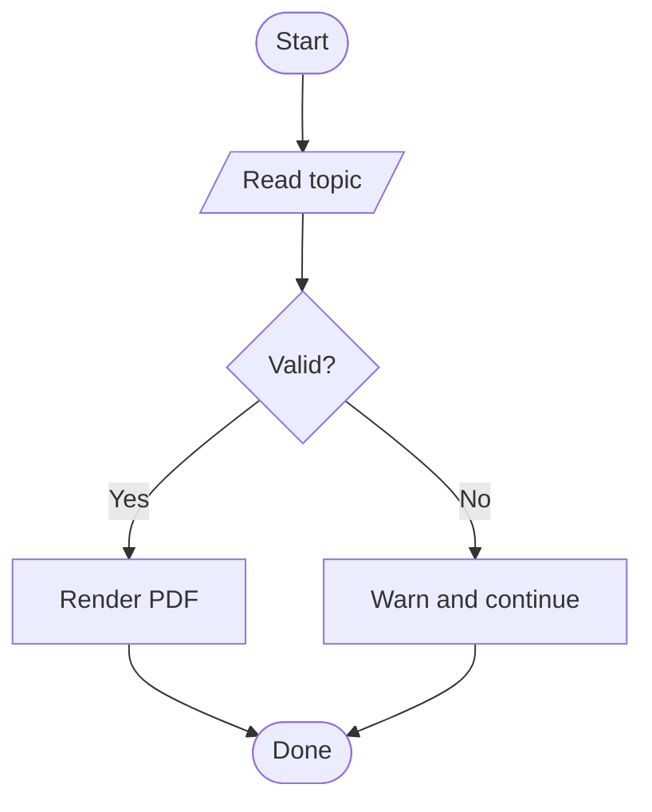

### Diagramme de Gantt

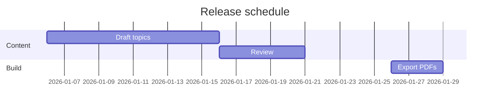

### Graphique Git

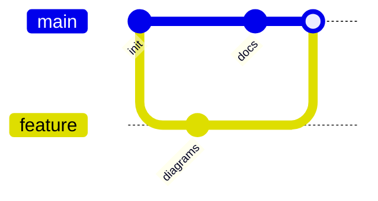

### Tableau Kanban

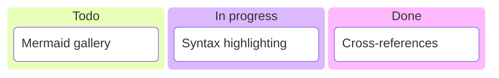

### Carte mentale

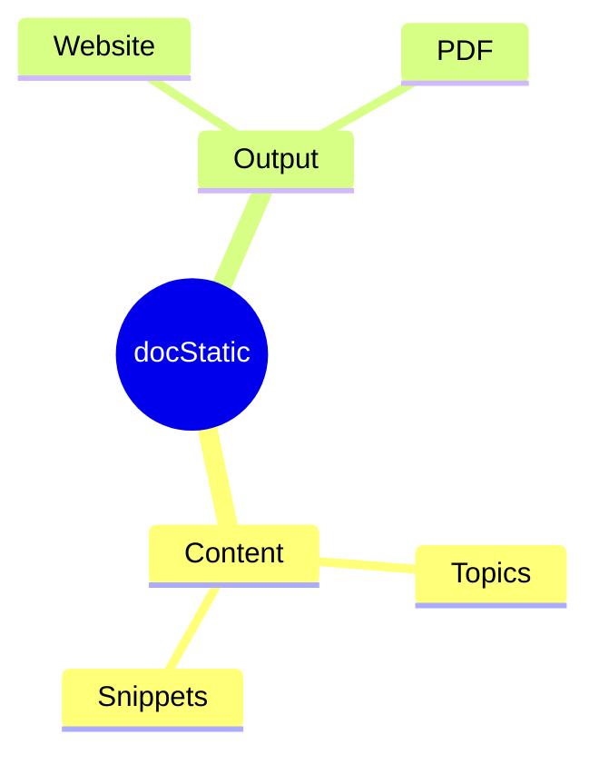

### Diagramme de paquets

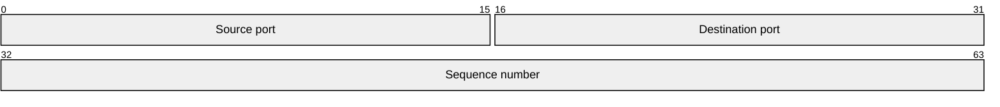

### Diagramme circulaire

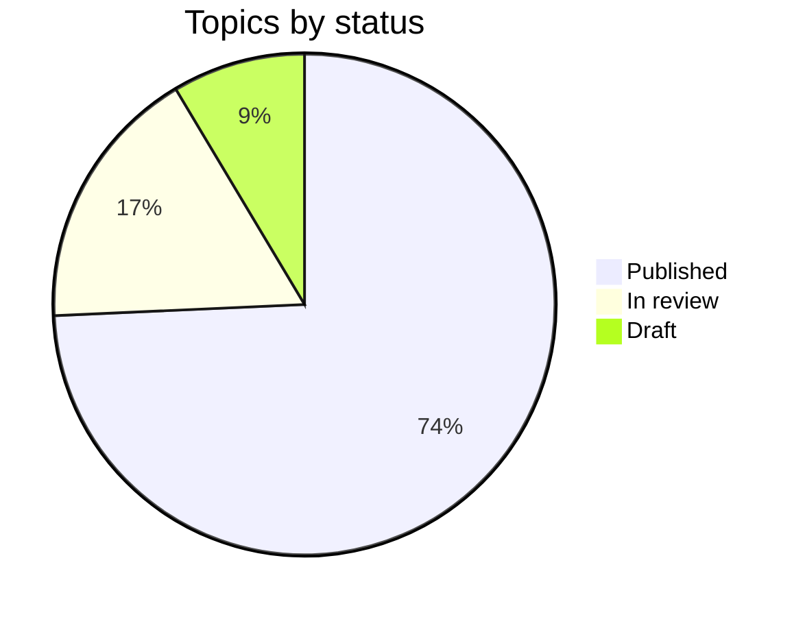

### Diagramme en quadrants

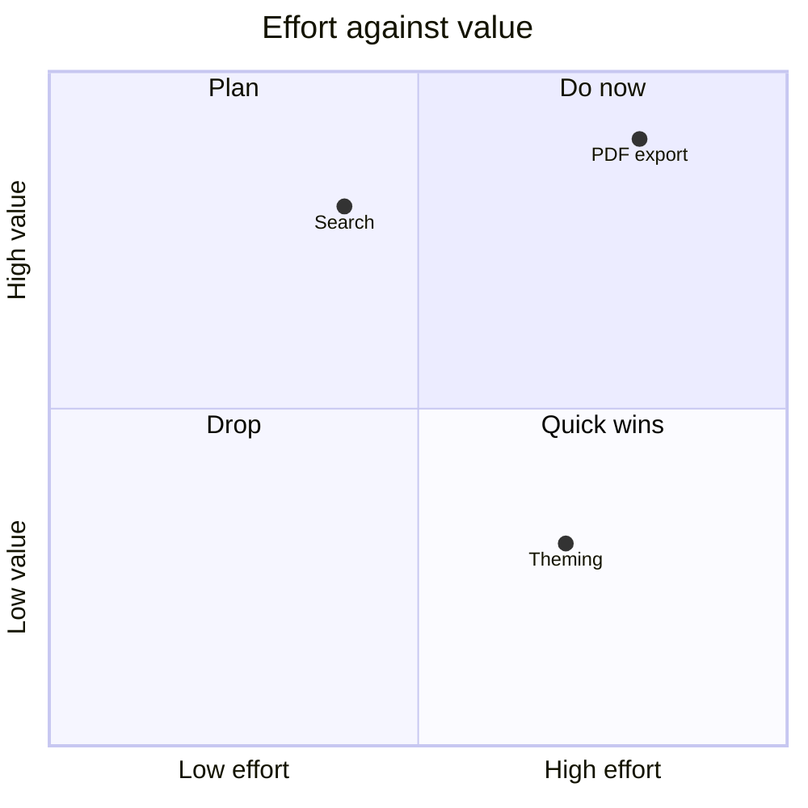

### Diagramme radar

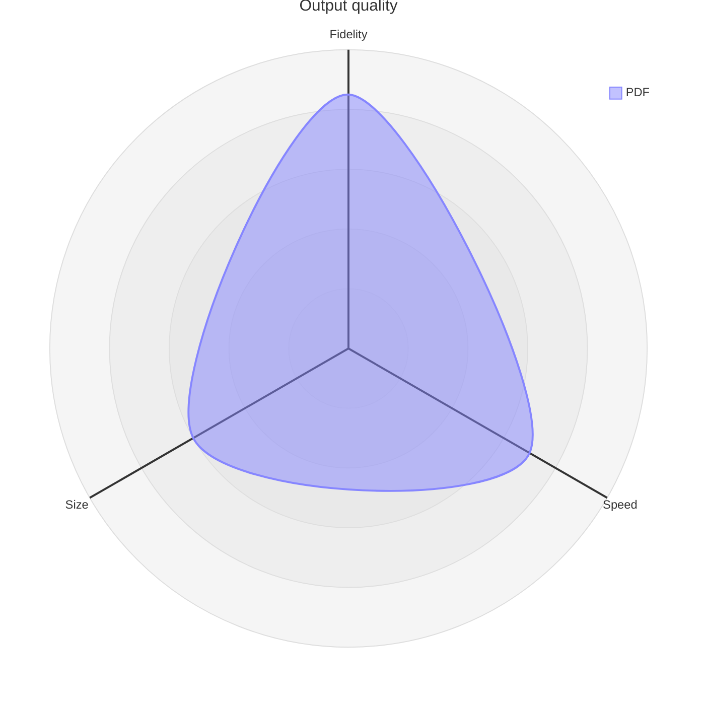

### Diagramme des exigences

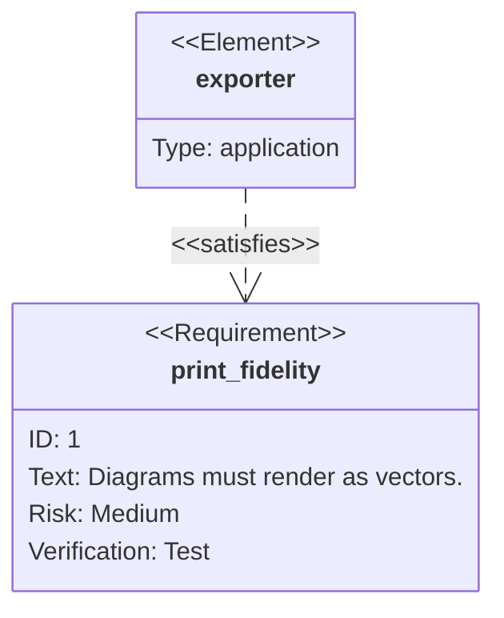

### Diagramme de Sankey

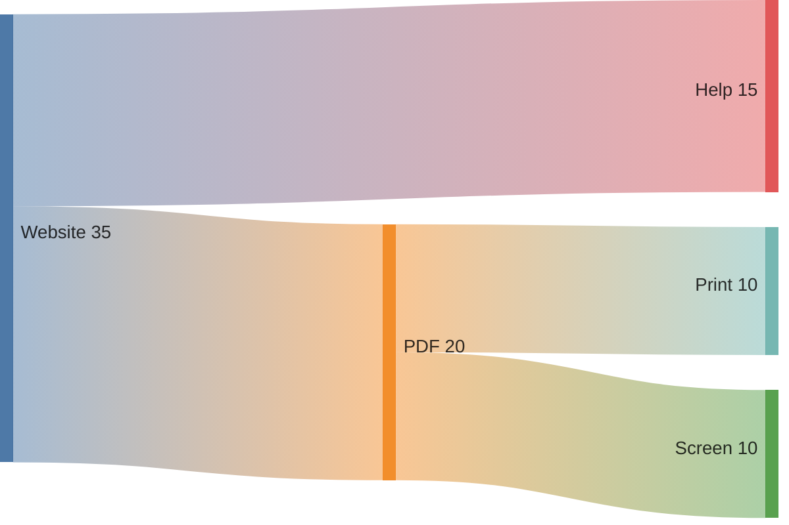

### Diagramme de séquence

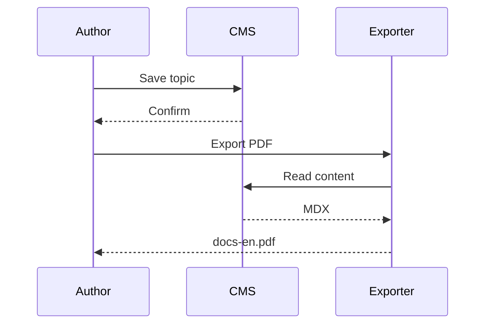

### Diagramme d'états

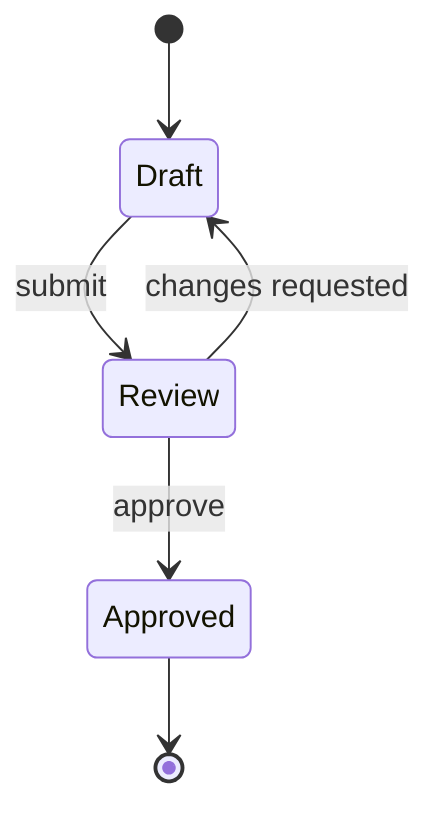

### Chronologie

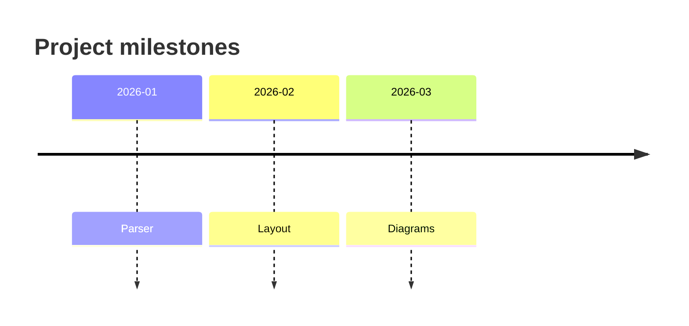

### Carte arborescente

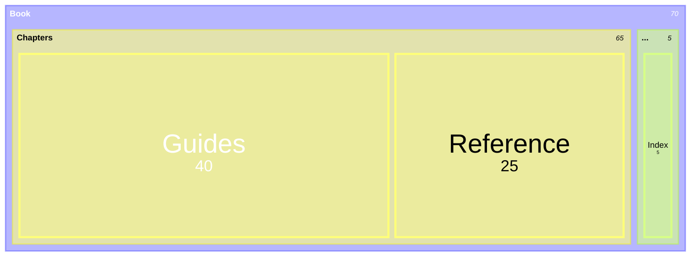

### Parcours utilisateur

```mermaid
journey
    title Publishing a topic
    section Write
      Draft the topic: 4: Author
      Add screenshots: 3: Author
    section Publish
      Review: 3: Editor
      Export PDF: 5: Author
```

### Graphique XY

```mermaid
xychart-beta
    title "Pages per release"
    x-axis [v1, v2, v3, v4]
    y-axis "Pages" 0 --> 120
    bar [40, 65, 88, 101]
    line [40, 65, 88, 101]
```

<RelatedTopics maxResults={7} />
