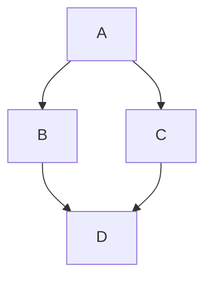

# ダイアグラム

ダイアグラムは、コードブロック内で [Mermaid](https://mermaid.js.org/) を使用してレンダリングできます。

## 使い方

CMS は Mermaid ダイアグラムの編集を直接サポートしています。

1. **Mermaid** アイコンをクリックします。
2. ボックスに Markdown を入力します。

**Preview** をクリックしてダイアグラムを確認します。

#### 例：

<Admonition type="note" title="注意">
  現在、zenUML ダイアグラムはサポートされておらず、マインドマップダイアグラムは予期しない動作が発生する場合があります。すべてのダイアグラムタイプが CMS でプレビューできるわけではありません。
</Admonition>

詳細については、TinaCMS ドキュメントの [Mermaid](https://tina.io/docs/reference/rich-text-usage/mermaid) を参照してください。

Mermaid のテーマ設定については、Docusaurus ドキュメントの [Diagrams](https://docusaurus.io/docs/markdown-features/diagrams) を参照してください。

<RelatedTopics maxResults={7} />
