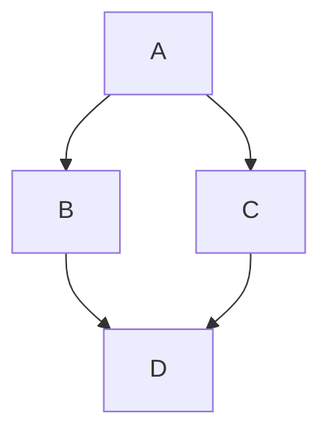

# Diagrams

Diagrams can be rendered using [Mermaid](https://mermaid.js.org/) in a code block.

## Use

The CMS directly supports editing Mermaid diagrams.

1. Click the **Mermaid** icon.
2. Enter the Markdown in the box.

Click **Preview** to view your diagram.

#### Example:

<Admonition type="note" title="Note">
  Currently, zenUML diagrams are not supported and mind map diagrams may produce unusual behaviour. Not all diagram types can be previewed in the CMS.
</Admonition>

For more information, refer to [Mermaid](https://tina.io/docs/reference/rich-text-usage/mermaid) in the TinaCMS documentation.

For information on theming Mermaid, refer to [Diagrams](https://docusaurus.io/docs/markdown-features/diagrams) in the Docusaurus documentation.

<RelatedTopics maxResults={7} />
