# ダイアグラム

ダイアグラムは、コードブロック内で <Url urlKey="mermaid" /> を使用してレンダリングできます。

## 使い方

CMS は Mermaid ダイアグラムの編集を直接サポートしています。

1. **Mermaid** アイコンをクリックします。
2. ボックスに Markdown を入力します。

**Preview** をクリックしてダイアグラムを確認します。

#### 例：

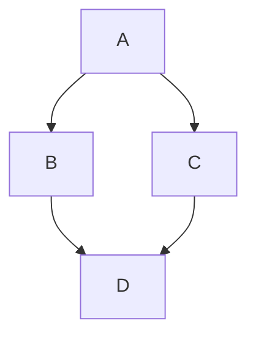
```mermaid
graph TD;
    A-->B;
    A-->C;
    B-->D;
    C-->D;
```

<Admonition type="note" title="注意">
  現在、zenUML ダイアグラムはサポートされておらず、マインドマップダイアグラムは予期しない動作が発生する場合があります。すべてのダイアグラムタイプが CMS でプレビューできるわけではありません。
</Admonition>

詳細については、TinaCMS ドキュメントの [Mermaid](https://tina.io/docs/reference/rich-text-usage/mermaid) を参照してください。

Mermaid のテーマ設定については、Docusaurus ドキュメントの <Url urlKey="docusaurus-diagrams" /> を参照してください。

## 例

### アーキテクチャ図

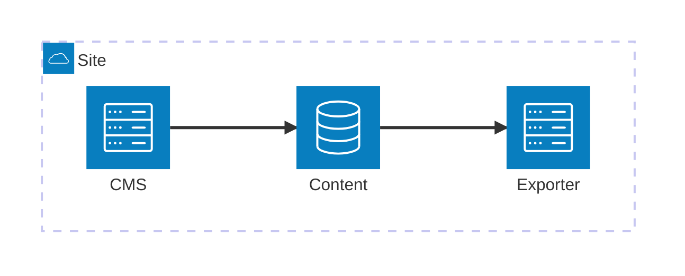
```mermaid
architecture-beta
    group site(cloud)[Site]
    service cms(server)[CMS] in site
    service store(database)[Content] in site
    service pdf(server)[Exporter] in site
    cms:R --> L:store
    store:R --> L:pdf
```

### ブロック図

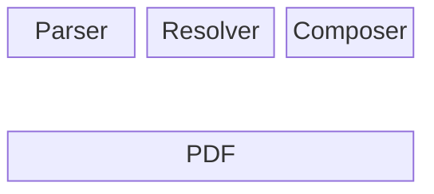
```mermaid
block-beta
    columns 3
    Parser["Parser"] Resolver["Resolver"] Composer["Composer"]
    space:3
    PDF["PDF"]:3
```

### C4コンテキスト図

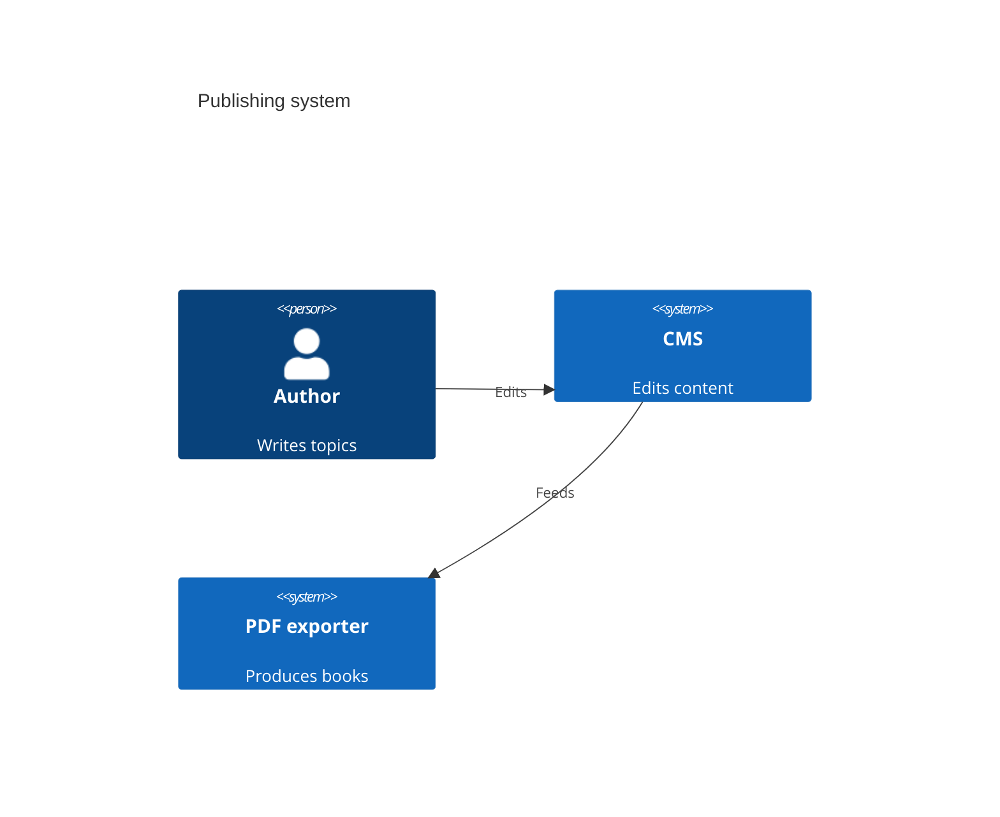
```mermaid
C4Context
    title Publishing system
    Person(author, "Author", "Writes topics")
    System(cms, "CMS", "Edits content")
    System(exporter, "PDF exporter", "Produces books")
    Rel(author, cms, "Edits")
    Rel(cms, exporter, "Feeds")
```

### クラス図

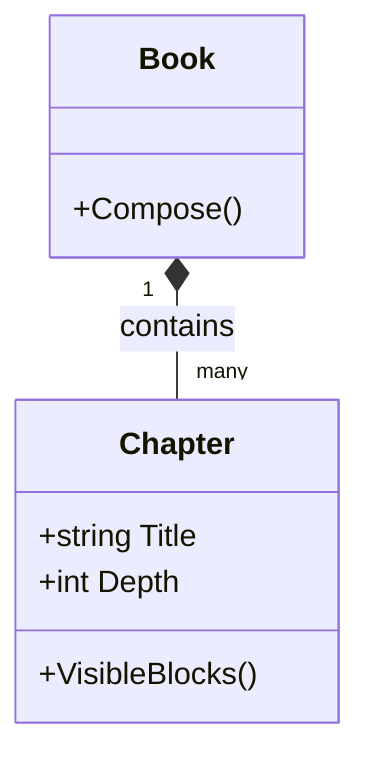
```mermaid
classDiagram
    class Chapter {
        +string Title
        +int Depth
        +VisibleBlocks()
    }
    class Book {
        +Compose()
    }
    Book "1" *-- "many" Chapter : contains
```

### ER図

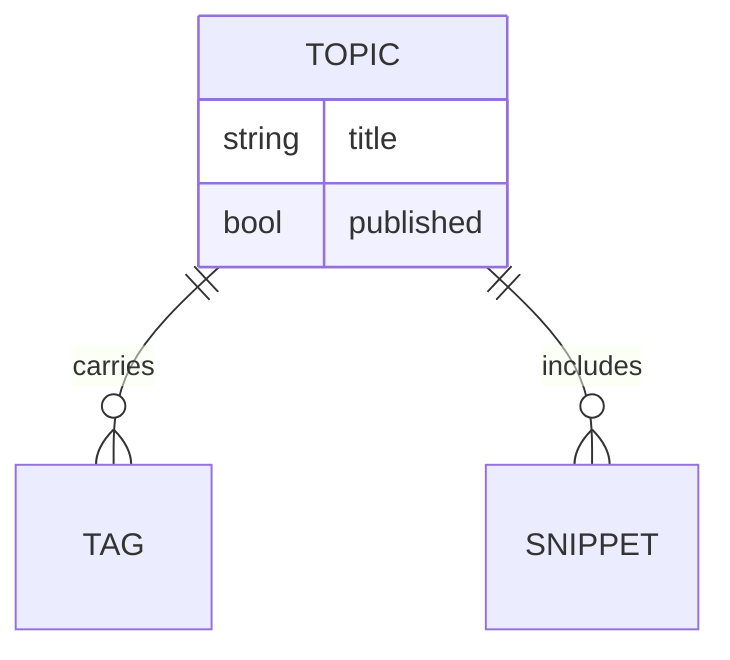
```mermaid
erDiagram
    TOPIC ||--o{ TAG : carries
    TOPIC ||--o{ SNIPPET : includes
    TOPIC {
        string title
        bool published
    }
```

### フローチャート

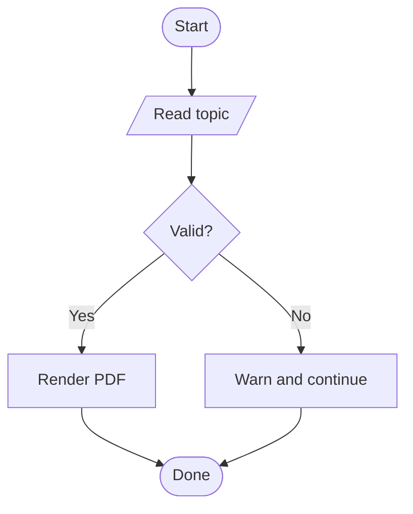
```mermaid
flowchart TD
    Start([Start]) --> Input[/Read topic/]
    Input --> Check{Valid?}
    Check -->|Yes| Render[Render PDF]
    Check -->|No| Warn[Warn and continue]
    Render --> Done([Done])
    Warn --> Done
```

### ガントチャート

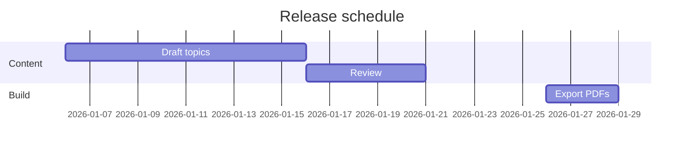
```mermaid
gantt
    title Release schedule
    dateFormat YYYY-MM-DD
    section Content
    Draft topics      :a1, 2026-01-06, 10d
    Review            :after a1, 5d
    section Build
    Export PDFs       :2026-01-26, 3d
```

### Gitグラフ

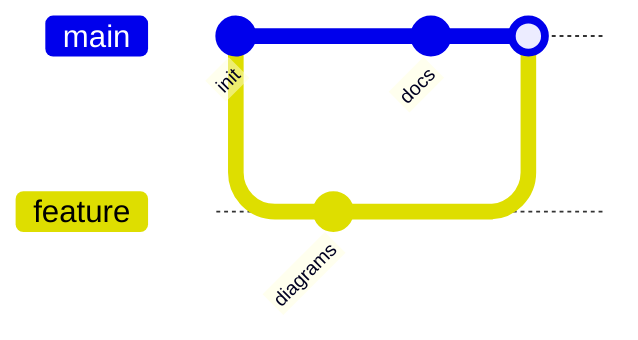
```mermaid
gitGraph
    commit id: "init"
    branch feature
    commit id: "diagrams"
    checkout main
    commit id: "docs"
    merge feature
```

### かんばんボード

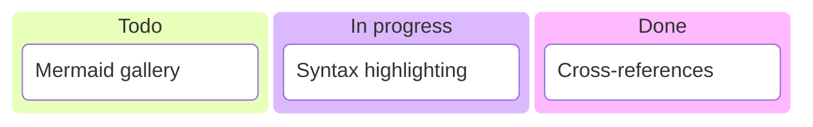
```mermaid
kanban
    Todo
        [Mermaid gallery]
    In progress
        [Syntax highlighting]
    Done
        [Cross-references]
```

### マインドマップ

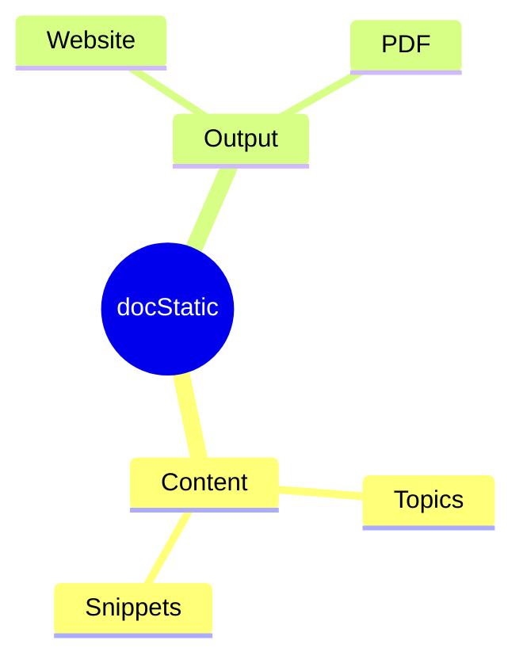
```mermaid
mindmap
  root((docStatic))
    Content
      Topics
      Snippets
    Output
      Website
      PDF
```

### パケット図

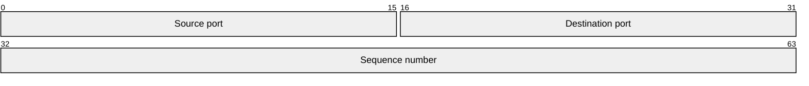
```mermaid
packet-beta
    0-15: "Source port"
    16-31: "Destination port"
    32-63: "Sequence number"
```

### 円グラフ

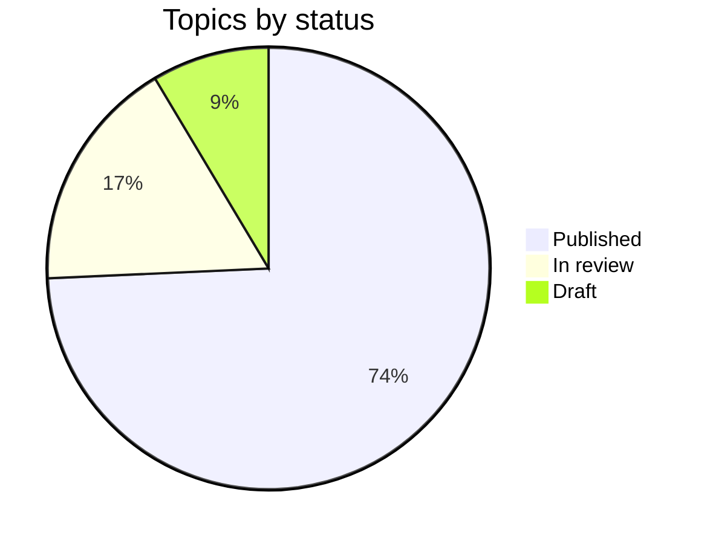
```mermaid
pie title Topics by status
    "Published" : 52
    "In review" : 12
    "Draft" : 6
```

### 象限図

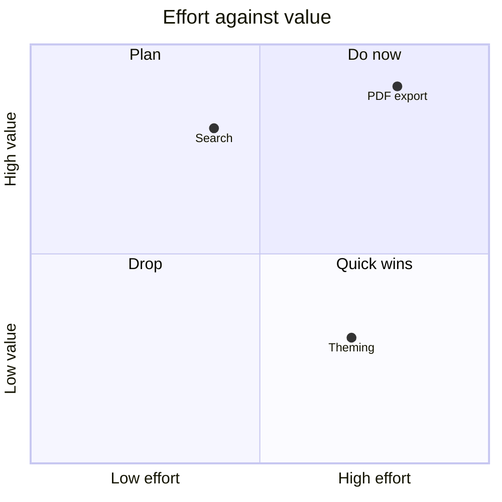
```mermaid
quadrantChart
    title Effort against value
    x-axis Low effort --> High effort
    y-axis Low value --> High value
    quadrant-1 Do now
    quadrant-2 Plan
    quadrant-3 Drop
    quadrant-4 Quick wins
    Search: [0.4, 0.8]
    Theming: [0.7, 0.3]
    PDF export: [0.8, 0.9]
```

### レーダーチャート

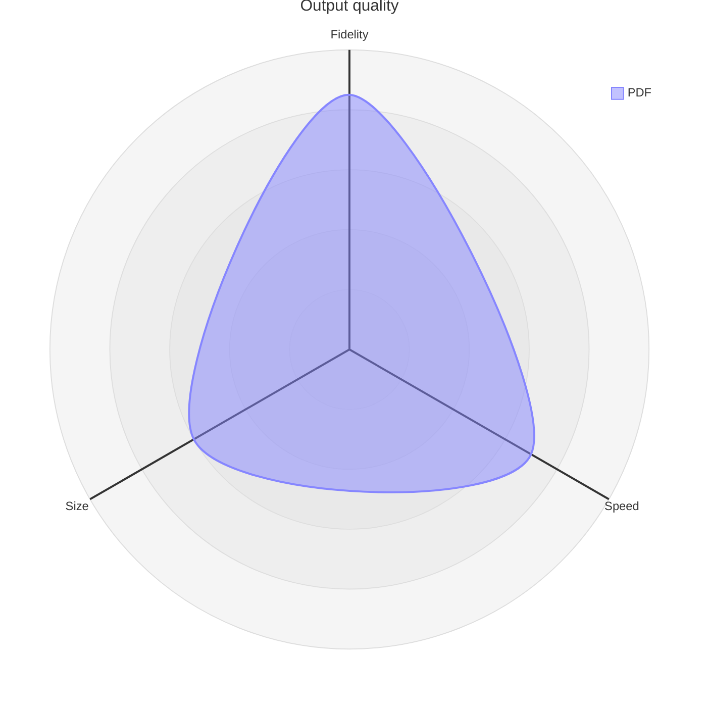
```mermaid
radar-beta
    title Output quality
    axis fidelity["Fidelity"], speed["Speed"], size["Size"]
    curve pdf["PDF"]{85, 70, 60}
    max 100
```

### 要求図

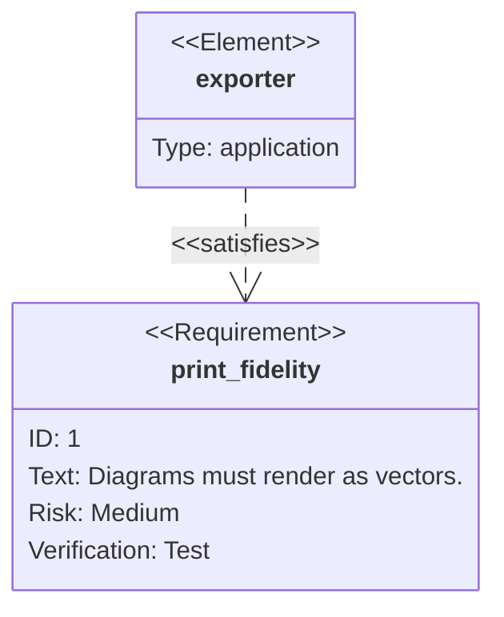
```mermaid
requirementDiagram
    requirement print_fidelity {
        id: 1
        text: Diagrams must render as vectors.
        risk: medium
        verifymethod: test
    }
    element exporter {
        type: application
    }
    exporter - satisfies -> print_fidelity
```

### サンキー図

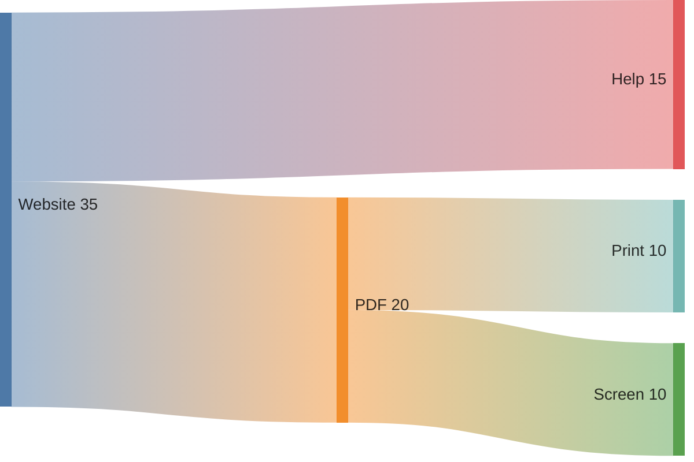
```mermaid
sankey-beta
Website,PDF,20
Website,Help,15
PDF,Print,10
PDF,Screen,10
```

### シーケンス図

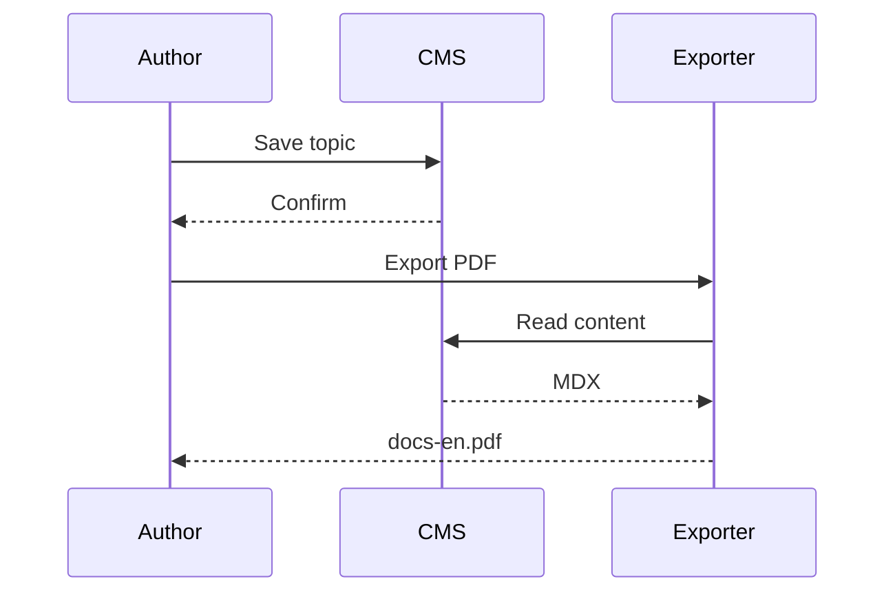
```mermaid
sequenceDiagram
    participant Author
    participant CMS
    participant Exporter
    Author->>CMS: Save topic
    CMS-->>Author: Confirm
    Author->>Exporter: Export PDF
    Exporter->>CMS: Read content
    CMS-->>Exporter: MDX
    Exporter-->>Author: docs-en.pdf
```

### 状態遷移図

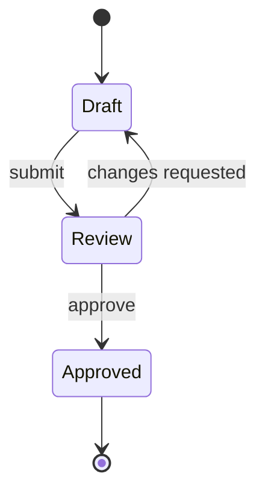
```mermaid
stateDiagram-v2
    [*] --> Draft
    Draft --> Review : submit
    Review --> Draft : changes requested
    Review --> Approved : approve
    Approved --> [*]
```

### タイムライン

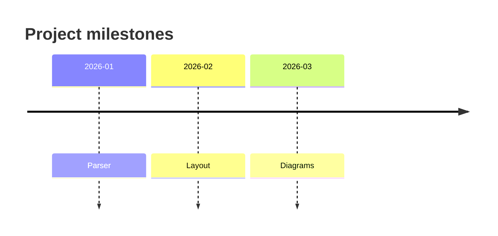
```mermaid
timeline
    title Project milestones
    2026-01 : Parser
    2026-02 : Layout
    2026-03 : Diagrams
```

### ツリーマップ

```mermaid
treemap-beta
"Book"
    "Chapters"
        "Guides": 40
        "Reference": 25
    "Back matter"
        "Index": 5
```

### ユーザージャーニー

```mermaid
journey
    title Publishing a topic
    section Write
      Draft the topic: 4: Author
      Add screenshots: 3: Author
    section Publish
      Review: 3: Editor
      Export PDF: 5: Author
```

### XYチャート

```mermaid
xychart-beta
    title "Pages per release"
    x-axis [v1, v2, v3, v4]
    y-axis "Pages" 0 --> 120
    bar [40, 65, 88, 101]
    line [40, 65, 88, 101]
```

<RelatedTopics maxResults={7} />
